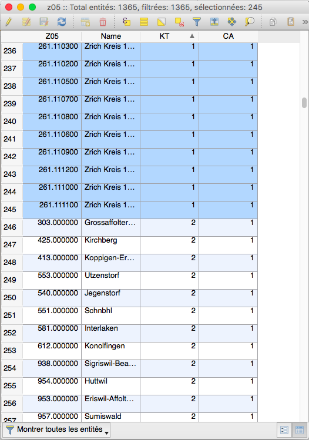

# Sélection des zones Z05

Dans le cadre de votre projet, vous serez amenés à travailler sur une région d'études composée de deux cantons ou plus. Les données contenues dans le dossier [data](../../data/stats) recouvrent les zones Z05 de l'ensemble du territoire suisse : vous devez donc *extraire* les données des cantons qui vous intéressent. Pour ce faire, deux options s'offrent à vous:

1. Extraire les données "manuellement" depuis les tableur Excel
2. Utiliser une script **R** permettant d'automatiser cette procédure

Vous êtes naturellement libres sur le choix de la méthode

## 1) Extraction "manuelle" avec Excel

La table d'attributs du *shapefile* des zones Z05 (contenu dans le dossier [shp](../../data/shp)) donne une correspondance entre les identifiants des zones Z05 et les géocodes des cantons de 1 à 26 (attribut *KT*). Ces identifiants sont distribués dans l'ordre croissant selon le canton:

- *P.ex:* Le géocode du canton de Zurich est le **1**. Les zones Z05 correspondant à ce canton vont des *id* **1.000000** à **261.111100**.

En vous basant sur cette correspondance entre zone Z05 et numéro de canton, vous pouvez sélectionner les lignes correspondantes aux canton séelectionné depuis les données de base puis les copier dans un nouveau classeur Excel.

## 2) Extraction à l'aide d'un script **R**

Pour les plus aventureux, il est possible d'effectuer toutes ces manipulations à l'aide de **R**. Pour vous guider dans cette démarche, vous trouverez un exemple de script **R** (*selectBy.R*) dans le dossier [script](script). Dans cet exemple, le script permet d'extraire les données des zones Z05 du *canton de Vaud* pour la catégorie *socio-économique*. Ceci se fait en 5 étapes décrites dans le [notebook suivant](selectBy.ipynb). Une fois tous les fichiers réunis il vous suffit d'adapter ce script à vos données(socio économiques, démographiques, construction *etc.*) et vos cantons respectifs. N'oubliez pas d'exporter votre nouveau jeu de données à l'aide de la commande `write.csv()`
