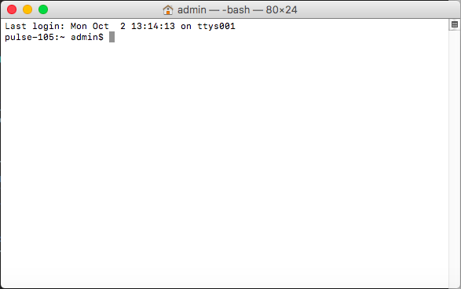
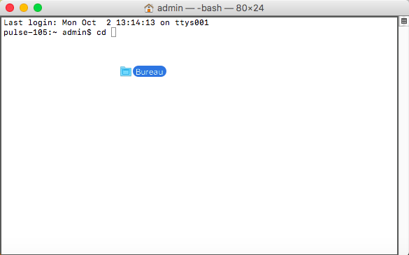
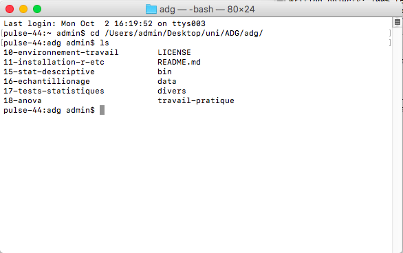
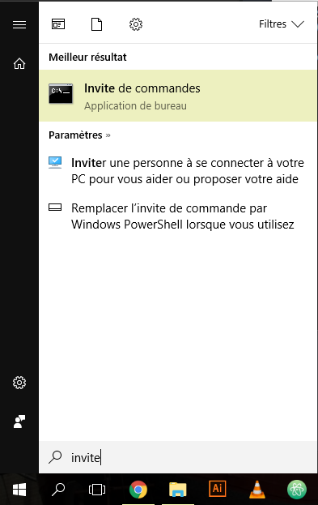
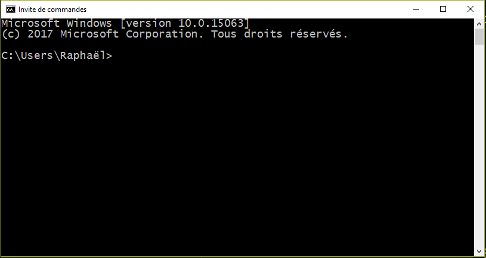
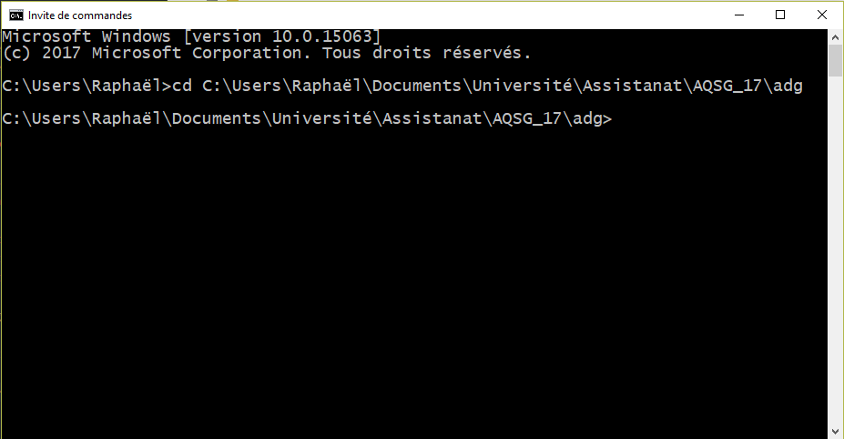
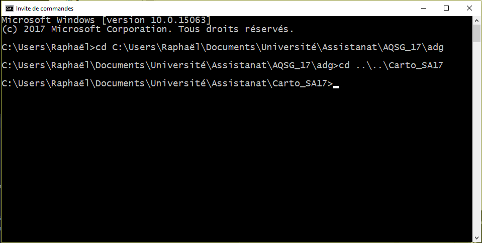
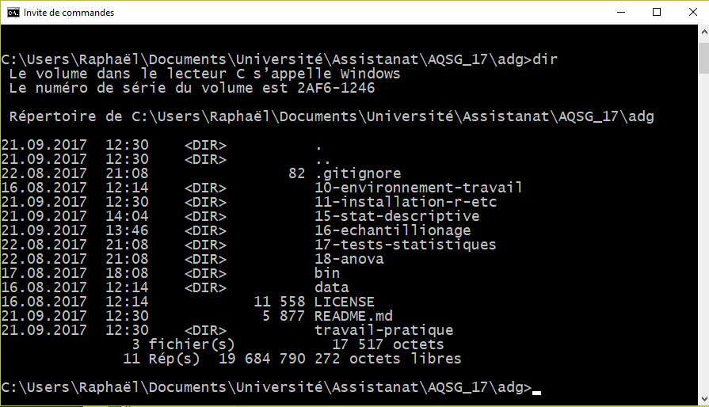

# Quelques commandes du terminal / invite de commandes qui peuvent servir

Le **Terminal** (*OSx*, *Linux*) ou l'**invite de commande** (*Windows*) est le lieu où il est possible d'entrer des commandes qui permettent d'exécuter différentes actions sans recourir à l'interface graphique et de façon plus rapide et efficace.

Ce document est divisé en deux parties car le système d'exploitation de Windows ne repose pas sur la même base (UNIX) que Linux et Mac. Il y a donc quelques subtilités et différences dans les deux.

## Le Terminal de Mac

Le Terminal est accessible soit par une simple recherche *Spotlight* Mac (chercher *"terminal*) ou via le *Finder* : aller dans **Applications > Utilitaires > Terminal**. Une fenêtre de terminal se présente de la manière suivante:

#### Commandes utiles

Il existe une multitude de commandes possibles et de nombreuses autres que vous pouvez ajouter au fur et à mesure que vous installez des programmes sur votre ordinateur.

##### Navigation dans les dossiers
Par défaut votre terminal est lancé *à la racine* de votre disque dur. Il est donc parfois nécessaire de naviguer dans l'arborescence de vos dossiers et de documents. `cd` signifie *change directory*.
On peut l'utiliser de différentes façons :

- Naviguer pas à pas dans les dossiers, en utilisant `cd nomDossier`
- Aller directement dans le dossier cible, avec `cd chemindAccesAuDossier`. Cette manipulation peut également s'effectuer en écrivant `cd` dans le terminal puis en glissant le dossier sélectionné depuis une fenête de *Finder*:

- Naviguer de façon relative, où `cd ../` permet de revenir au dossier parent (*i.e.* le dossier contenant le dossier actuel). `cd ../../` permet de reculer de deux dossiers parents et ainsi de suite.

Il est délicat de mémoriser l'organisation des dossiers sur sa machine. Il y existe 2 façons de s'en sortir un peu plus vite quand on navigue avec `cd`:

- Après avoir écrit `cd`, si on fait un espace et utilise *Tab*, il est possible de passer l'entier du dossier en revue. De même, si on commence à écrire, par exemple, `cd Doc`, avec *Tab* il est possible d'auto-compléter avec les dossiers qui commencent par *doc* (affiche directement le bon, s'il n'y en a qu'un). Dans ce cas `cd Doc` puis *Tab* se complète en `cd Documents`. A noter que ces notations sont *case sensitive*, c'est à dire sensible aux majuscules.
- La commande `ls`, qui permet d'obtenir une liste des éléments présents dans le dossier actuel

Enfin, si vous préférez une interface graphique pour vous retrouver, vous pouvez toujours ouvrir le dossier dans lequel vous êtes dans une fenêtre de *Finder* à l'aide de la commande `open .`

### Exemple complet avec Git et jupyter notebooks

##### Introduction

Cet exemple part du principe que vous avez installé [Git](https://git-scm.com/download/win) et [Anaconda](https://github.com/christiankaiser/adg/tree/master/11-installation-r-etc) et qu'ils sont ajoutés à votre *Path*. Vous obtiendrez, au final, le cas d'organisation suivante : un dossier (parent) du cours avec dedans le dossier *adg* (issu du git) et de l'autre un dossier MesNotebooks :

- DossierCours
 - adg
 - MesNotebooks

Parmi les étapes qui suivent, les n° 1 et 2 sont des étapes de préparation à ne réaliser qu'une fois, les n° 3 et 4 seront à répéter lorsque vous venez en cours/travaillez sur le projet.

##### 1. Création des dossiers nécessaires

1. Ouvrez votre terminal, puis naviguez à l'aide de **`cd`** jusque dans le dossier où vous souhaitez créer le nouveau dossier de cours.
2. Créez votre dossier de cours avec `mkdir nomDossierCours`
3. Déplacez-vous dans ce nouveau dossier `cd nomDossierCours`
4. Créez votre dossier MesNotebooks qui contiendra vos différents notebooks et/ou notes `mkdir MesNotebooks`
5. (fac.) Vérifiez l'existence de vos nouveaux dossier, soit depuis le terminal avec `ls` soit dans votre *Finder* avec `open .`

##### 2. Clonage du répertoire Git

Comme vous l'avez sûrement remarqué, il n'y a pas encore le dossier de cours. Vous avez 2 façons de l'ajouter :
- Télécharger chaque semaine un dossier compressé (.zip) contenant l'ensemble du cours, le décompresser et remplacer l'entier de l'ancien dossier par le nouveau, ou
- Cloner le répertoire Git et l'actualiser chaque semaine en une seule commande !

Cette étape d'installation est à effectuer une seule fois et vous fera gagner du temps chaque fois que le site du cours est mis à jour.

1. Rendez-vous sur la page GitHub du cours. Sur le côté droit de la page se trouve un bouton _Clone or download_. Copiez l'adresse qu'il contient (peut se faire en cliquant le bouton à droite de l'adresse)

2. Retournez dans l'IC, au répertoire du cours et exécutez la commande de clonage __`git clone adresseCopiée`__ (nécessite une connexion internet)

Tous les documents ont ainsi été copiés sur votre machine et cette dernière sait où aller chercher les documents nécessaires.

##### 3. Actualisation du dossier de cours
**Cette opération est à répéter chaque semaine (ou chaque fois que vous travaillez sur le cours)**

Dans l'IC, allez dans le dossier *adg* et effectuez la commande __`git pull`__, celle-ci va aller automatiquement télécharger les nouveaux documents et fichiers mis à jour depuis la dernière fois (et uniquement ceux-ci).

Vous obtenez une liste comprenant les documents modifiés :

S'il n'y a rien de nouveau à télécharger, __`Already up-to-date.`__ sera affiché

Si vous obtenez un message d'erreur du type _not a git repository_, vous n'êtes sûrement pas dans le bon dossier.

##### 4. Lancement du serveur de notebooks
Finalement, quand le dossier de cours est à jour, vous pouvez lancer votre serveur de notebooks.

Retournez dans le dossier de cours et exécutez **`jupyter notebook`** ([A condition d'avoir fait les 4 premiers points des installations](https://github.com/christiankaiser/adg/tree/master/11-installation-r-etc))

Ce qui entraîne l'ouverture automatique dans le navigateur internet

A partir de là, vous pouvez, par exemple, ouvrir dans un onglet le dossier *adg* et ses différents notebooks et dans un autre onglet votre dossier pour éditer vos notebooks en parallèle.

Pour quitter le serveur (**après avoir sauvegardé vos notebooks**), il suffit de retourner dans l'IC où il "tourne" et d'effectuer **`Ctrl`** + **`C`** deux fois.

#### Remarques
Il est possible de naviguer dans les commandes déjà exécutées, à l'aide des touches **`↑`** et **`↓`**. Il est possible d'afficher caractère par caractère la dernière commande avec **`→`**.

Dans la mesure du possible, **évitez les accents et espaces** dans vos noms de dossiers et fichiers, ceux-ci peuvent poser problèmes à certains logiciels dont l'encodage est différent. Vous risquez de vous retrouver avec des problèmes d'installations et/ou des fichiers corrompus (*NB* par expérience, les accents dans le nom d'utilisateur sont à proscrire !)

Un des défauts notables, relativement aux Macs, c'est qu'il faut ajouter manuellement le chemin d'accès à certains programme dans le *PATH* pour utiliser la commande. Il n'est donc pas possible de simplement taper **`R`** dans l'IC après l'avoir installé. Ce n'est pas si compliqué, demandez si vous êtes intéressés.

##### Autres commandes

- **`cd\`** : retour à la racine du disque

- **`start .`** : ouvre l'explorateur de fichiers au répertoire courant

- **`mkdir nomDossier`** : crée un dossier de ce nom dans le répertoire courant

- **`ren x y`** : renomme le fichier x en y

- **`exit`** : quitte l'invite de commandes

- **`atom`** : si *Atom* est installé, l'ouvre au répertoire courant

- **`color 0a`** : pour un style *Matrix*

- **`color 07`** : fond noir (0), écriture blanche (7)

## L'invite de commandes Windows

Il existe plusieurs façons d'accéder à l'invite de commande (IC). Il est possible de taper *Invite de commandes* dans la recherche Windows et de cliquer dessus. Il est également possible d'utiliser le raccourci **`Win`** + **`R`** et d'ouvrir **`cmd`**.

Une fois lancé, voici à quoi ressemble l'IC. Vous arrivez dans votre dossier utilisateur, ce que la console vous indique **`C:\Users\nomUtilisateur>`**. Ce qui se trouve avant le **`>`** est le répertoire actuel, ce qui se trouve après est la commande à exécuter.

#### Commandes utiles

Il existe une multitude de commandes possibles et de nombreuses autres que vous pouvez ajouter au fur et à mesure que vous installez des programmes sur votre ordinateur. En voici 2 pour bien commencer, vous en trouverez d'autres dans l'exemple pratique, ainsi qu'en fin de document.

##### cd
Cette commande sert à naviguer dans l'arborescence de vos dossiers et documents. **`cd`** signifie *change directory*.
On peut l'utiliser de différentes façons :

- Naviguer pas à pas dans les dossiers, en utilisant **`cd nomDossier`**

  

- Aller directement dans le dossier cible, avec **`cd chemindAccesAuDossier`**

  

  *NB* Il est possible de copier le chemin d'accès dans la barre en haut de l'explorateur de fichiers
  

- Naviguer de façon relative (comme pour charger un fichier dans *R*, par ex.), où **`cd ..`** permet de sortir du dossier actuel

  

On ne se rappelle pas tous exactement de comment sont organisés nos dossiers, de quel est le prochain niveau dans l'arborescence, etc. Il y a donc 2 façons de s'en sortir un peu plus vite quand on navigue avec **`cd`**.
- Après avoir écrit **`cd`**, si on fait un espace et utilise *Tab*, il est possible de passer l'entier du dossier en revue. De même, si on commence à écrire, par exemple, **`cd doc`**, avec *Tab* il est possible d'auto-compléter avec les dossiers qui commencent par *doc* (affiche directement le bon, s'il n'y en a qu'un). Dans ce cas **`cd doc`** puis *Tab* se complète en **`cd Documents`**.

- La commande **`dir`**

##### dir
Cette commande permet d'obtenir un aperçu des dossiers et documents présents dans le répertoire (*directory*) actuel. On obtient également les informations sur la dernière modification, si c'est un dossier (**`<DIR>`**) ou non, la taille des fichiers (en octets) et si c'est un fichier/dossier caché (le nom commence par un point).

### Exemple complet avec Git et jupyter notebooks

##### Introduction

Cet exemple part du principe que vous avez installé [Git](https://git-scm.com/download/win) et [Anaconda](https://github.com/christiankaiser/adg/tree/master/11-installation-r-etc) et qu'ils sont ajoutés à votre _Path_. Vous obtiendrez, au final, le cas d'organisation suivante : un dossier (parent) du cours avec dedans le dossier _adg_ (issu du git) et de l'autre un dossier MesNotebooks :

- DossierCours
 - adg
 - MesNotebooks

Parmi les étapes qui suivent, les n° 1 et 2 sont des étapes de préparation à ne réaliser qu'une fois, les n° 3 et 4 seront à répéter lorsque vous venez en cours/travaillez sur le projet.

##### 1. Création des dossiers nécessaires

1. Ouvrez votre IC, puis naviguez à l'aide de __`cd`__ jusque dans le dossier où vous souhaitez créer le nouveau dossier de cours.
2. Créez votre dossier de cours avec __`mkdir nomDossierCours`__
3. Déplacez-vous dans ce nouveau dossier __`cd nomDossierCours`__
4. Créez votre dossier MesNotebooks qui contiendra vos différents notebooks et/ou notes __`mkdir MesNotebooks`__
5. (fac.) Vérifiez l'existence de vos nouveaux dossier (2 façons différentes):
  - Avec __`dir`__
  - Ouvrez l'explorateur de fichiers avec __`start .`__

##### 2. Clonage du répertoire Git

Comme vous l'avez sûrement remarqué, il n'y a pas encore le dossier de cours. Vous avez 2 façons de l'ajouter :
- Télécharger chaque semaine un dossier compressé (.zip) contenant l'ensemble du cours, le décompresser et remplacer l'entier de l'ancien dossier par le nouveau, ou
- Cloner le répertoire Git et l'actualiser chaque semaine en une seule commande !

Cette étape d'installation est à effectuer une seule fois et vous fera gagner du temps chaque fois que le site du cours est mis à jour.

1. Rendez-vous sur la page GitHub du cours. Sur le côté droit de la page se trouve un bouton _Clone or download_. Copiez l'adresse qu'il contient (peut se faire en cliquant le bouton à droite de l'adresse)

2. Retournez dans l'IC, au répertoire du cours et exécutez la commande de clonage __`git clone adresseCopiée`__ (nécessite une connexion internet)

Tous les documents ont ainsi été copiés sur votre machine et cette dernière sait où aller chercher les documents nécessaires.

##### 3. Actualisation du dossier de cours
**Cette opération est à répéter chaque semaine (ou chaque fois que vous travaillez sur le cours)**

Dans l'IC, allez dans le dossier *adg* et effectuez la commande __`git pull`__, celle-ci va aller automatiquement télécharger les nouveaux documents et fichiers mis à jour depuis la dernière fois (et uniquement ceux-ci).

Vous obtenez une liste comprenant les documents modifiés :

S'il n'y a rien de nouveau à télécharger, __`Already up-to-date.`__ sera affiché

Si vous obtenez un message d'erreur du type _not a git repository_, vous n'êtes sûrement pas dans le bon dossier.

##### 4. Lancement du serveur de notebooks
Finalement, quand le dossier de cours est à jour, vous pouvez lancer votre serveur de notebooks.

Retournez dans le dossier de cours et exécutez **`jupyter notebook`** ([A condition d'avoir fait les 4 premiers points des installations](https://github.com/christiankaiser/adg/tree/master/11-installation-r-etc))

Ce qui entraîne l'ouverture automatique dans le navigateur internet

A partir de là, vous pouvez, par exemple, ouvrir dans un onglet le dossier *adg* et ses différents notebooks et dans un autre onglet votre dossier pour éditer vos notebooks en parallèle.

Pour quitter le serveur (**après avoir sauvegardé vos notebooks**), il suffit de retourner dans l'IC où il "tourne" et d'effectuer **`Ctrl`** + **`C`** deux fois.

#### Remarques
Il est possible de naviguer dans les commandes déjà exécutées, à l'aide des touches **`↑`** et **`↓`**. Il est possible d'afficher caractère par caractère la dernière commande avec **`→`**.

Dans la mesure du possible, **évitez les accents et espaces** dans vos noms de dossiers et fichiers, ceux-ci peuvent poser problèmes à certains logiciels dont l'encodage est différent. Vous risquez de vous retrouver avec des problèmes d'installations et/ou des fichiers corrompus (*NB* par expérience, les accents dans le nom d'utilisateur sont à proscrire !)

Un des défauts notables, relativement aux Macs, c'est qu'il faut ajouter manuellement le chemin d'accès à certains programme dans le *PATH* pour utiliser la commande. Il n'est donc pas possible de simplement taper **`R`** dans l'IC après l'avoir installé. Ce n'est pas si compliqué, demandez si vous êtes intéressés.

##### Autres commandes

- **`cd\`** : retour à la racine du disque

- **`start .`** : ouvre l'explorateur de fichiers au répertoire courant

- **`mkdir nomDossier`** : crée un dossier de ce nom dans le répertoire courant

- **`ren x y`** : renomme le fichier x en y

- **`exit`** : quitte l'invite de commandes

- **`atom`** : si *Atom* est installé, l'ouvre au répertoire courant

- **`color 0a`** : pour un style *Matrix*

- **`color 07`** : fond noir (0), écriture blanche (7)
